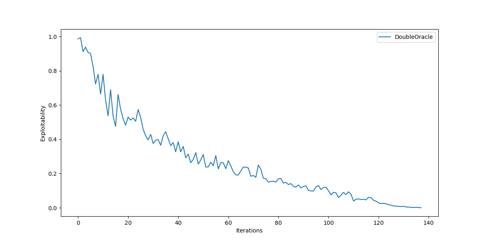
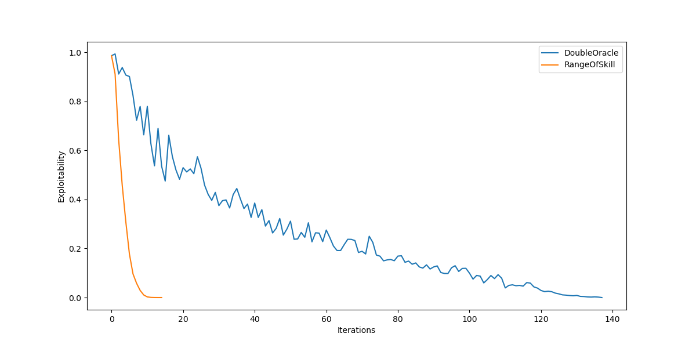
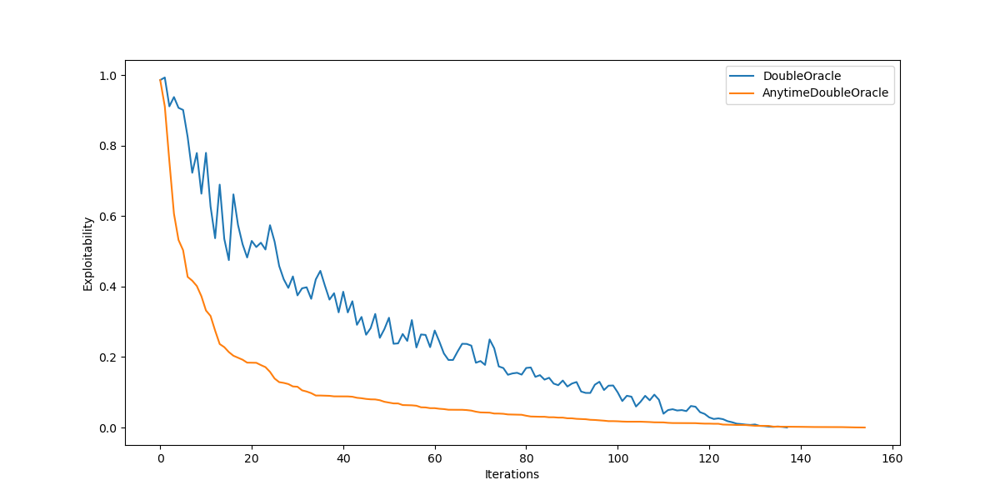
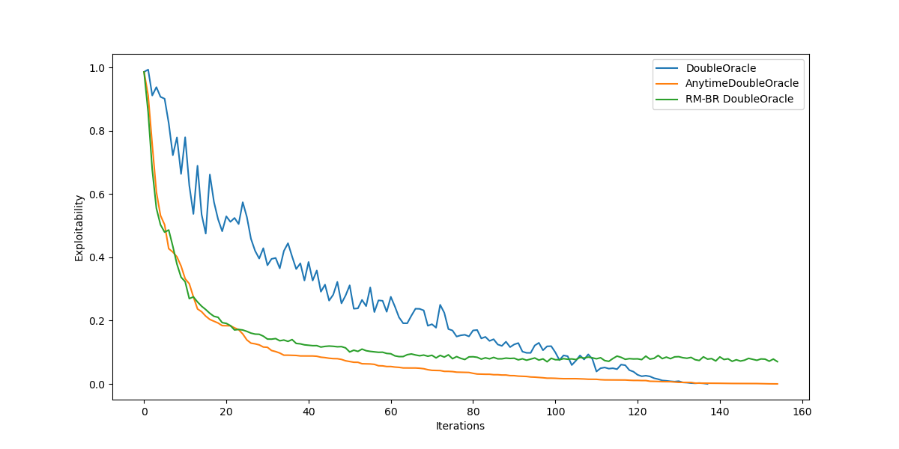

# 1. Introduction

This repository contains sample code to compare variants of the Double Oracle[^doubleoracle] algorithm for computing Nash equilibria in 2-player zero-sum games.

2-player zero-sum games model situations where players are competing for a shared resource and the gain of one player results in a loss of equal amount for the other player (hence the name 'zero-sum', since summing the gains and losses of every player yields zero for every possible game outcome).

## 1.1 Running the sample

The code is a python script and requires `numpy`, `scipy` and `matplotlib` packages to run. Simply invoke
```
python main.py
```
to solve a game matrix with 100 rows and columns filled with uniformly distributed random values in $[0,1]$ and visualize the exploitability and game value plots as the iterations progress.

The script optionally takes as arguments the matrix dimensions and the random seed. Note that for larger matrices, the hyperparameters of the regret minimization algorithm ([Section 6](#6-regret-minimization-against-a-best-response-double-oracle)) may require tuning; see the discussion below for more details.

```
usage: main.py [-h] [-r ROWS] [-c COLS] [-s SEED]

optional arguments:
  -h, --help            show this help message and exit
  -r ROWS, --rows ROWS  The rows of the random game matrix
  -c COLS, --cols COLS  The columns of the random game matrix
  -s SEED, --seed SEED  The RNG seed
```

## 2. Background

We consider 2-player zero-sum games in normal-form.
Each player $i = {1, 2}$ has a finite set of playable **actions** $\Lambda_i$, and the set of joint actions (**action profiles**) $\Lambda = \Lambda_1 \times \Lambda_2$ defines the space of all possible game outcomes.

A **strategy** $\pi_i$ is a discrete probability distribution over $\Lambda_i$, and a **strategy profile** $\pi = {\pi_1, \pi_2}$ is a strategies for all the players involved in the game (which is two in our case).
For a given player, a strategy $i$ is said to be _pure_ if it prescribes to play a single action with certainty, and _mixed_ if it randomizes over multiple actions.
The set of playable actions $S(\pi_i)$ under a strategy $\pi_i$ is the **support** of $\pi_i$.

Each player has associated a **utility function** $v_i: \Lambda \rightarrow \mathbb{R}$ which defines the player utility for any action profile. In zero-sum games, we have the additional constraint that $v_i = v_{-i}$, that is the utility of any player is the negation of the utility of its adversary.

The utility function of player $i$ for a given strategy profile $\pi$ represents the _expected utility_ of player $i$:

$$
    v_i(\pi) = \sum_{\lambda \in \Lambda} v_i(\lambda) \left( \pi_1(\lambda_1) \cdot \pi_2(\lambda_2) \right),
$$

where $\lambda_i$ is the action that player $i$ plays in $\lambda$.

In normal-form games, the payoffs of 2-player games are conveniently represented with matrices storing the utility values of the two players, sometimes compacted in a bi-matrix with two scalar values per cell representing the payoffs of the row and column player respectively.
In the case of 2-player zero-sum games, the payoff matrices are one the negation of the other, so the game can be more compactly modeled by a single matrix $A \in \mathbb{R}^{m \times n}$, where the matrix entries can be interpreted as the gain of one player and the loss of the other.
In such setting, one player (the row player in this document) seeks a strategy that maximizes the game value (their gain) while the other player seeks to minimize it (i.e. minimize their loss).
With this representation, for a row strategy $y \in \mathbb{R}^m$ and a column strategy $x \in \mathbb{R}^n$ the game value is

$$
    v = y^TAx
$$

Given a strategy $\pi_{-i}$, a **best response** $\mathbb{BR}_ i (\pi_{-i})$ is a strategy for $i$ that maximizes $v_i$ when the adversary plays $\pi_{-i}$, i.e.

$$
    \mathbb{BR}_i(\pi_{-i}) = \underset{\pi_i}{\operatorname{arg max}} v_i(\pi_i, \pi_{-i}).
$$

Note that a best response may not be unique, and for a mixed-strategy best response all the pure strategies that play any action in the support are themselves best responses to $\pi_{-i}$.

A **Nash equilibrium** is a strategy profile where each player's strategy is a best response to the strategy of the adversary.

## 2.1 Computing the Nash equilibrium with Linear Programming

Although the primary goal of the algorithms presented later is to _avoid_ computing a Nash equilibrium by solving a full linear program, they will still require to solve simpler games exactly.
For completeness, we quickly recall how to compute an exact Nash equilibrium exploiting the minmax theorem.
A fundamental result for 2-player zero sum games is that the the solution concepts of Nash equilibrium, minimax (a player seeking to minimize the maximum utility of the other) and maximin (a player seeking to maximize their minimum utility) are equivalent [^minimax].

Throughout the rest of this document we assume that the **row player** is the **maximin** player and the **column player** is the **minimax** player, both modeled with the same payoff matrix $A$ as stated above.

To compute the equilibrium strategy $x = \pi_1$ of the row player we need to solve the following minmax LP instance:
>$\phantom{s.t.}\\; \max v$
>
>$s.t.\\; \sum_i a_{ij} x_i \geq v \qquad j = 1, \dots, n$
>
>$\phantom{s.t.}\\; \sum_i x_i = 1$
>
>$\phantom{s.t.}\\; x \geq 0$

Similarly, to compute the equilibrium strategy $y = \pi_2$ of the column player we solve the following maxmin LP instance, which can be easily shown to be the _dual_ of the minmax problem above
>$\phantom{s.t.}\\; \min w$
>
>$s.t.\\; \sum_j a_{ij} y_j \leq w \qquad i = 1, \dots, m$
>
>$\phantom{s.t.}\\; \sum_j y_j = 1$
>
>$\phantom{s.t.}\\; y \geq 0$

In the python script these instances are solved by the functions `solve_maxmin` and `solve_minmax`, which both take as argument the game matrix $A$ and return the probability vector encoding the equilibrium strategy and the objective function value (i.e. the game value $v^*$).

# 3. Double Oracle algorithm

The double oracle algorithm [^doubleoracle] is an iterative scheme for computing NE in 2-player strictly competitive games.

The idea behind this algorithm is to _avoid_ solving the full game, instead solving progressively larger sub-games defined by **restricted subsets of pure strategies** available to each player.
This avoids computing and storing the full game matrix, which in many cases can be impractical to compute and store.
Moreover, since it's often the case that many strategies are clearly sub-optimal and contribute little in searching for the equilibrium point, the double oracle algorithm has the potential to converge in a reasonably low number of iterations, possibly offering a speedup compared to solving the full Linear Programming model.

The double oracle algorithm works as follows:

>***Double Oracle Algorithm***
>1. Let $\Pi^0 = \{\Pi^0_1, \Pi^0_2\}$ be the initial population of strategies for each player $i=1,2$
>2. **Repeat** at each iteration $t$
>    1. Compute the NE $\pi^t$ of the game restricted to the strategies in $\Pi^t$
>    2. For each player $i$, find a best response $\beta_i \leftarrow \mathbb{BR}_ i(\pi^t_{-i})$ using an oracle that searches in the full strategy space (unrestricted)
>    3. Add the best responses to each player population $\Pi^{t+1}_i \leftarrow \Pi^t_i \cup \{\beta_i\}$
>
>    **Until** No novel best response exists for either player
>3. **Return** $\pi^t$ as the NE of the full unrestricted game

It is easy to see that the algorithm is complete: eventually execution terminates with all the strategies added to each player population, producing a restricted game at the last iteration that is equivalent to the full unrestricted game.

However, the algorithm can terminate much sooner if the best response oracle is unable to find a best response that does not already belong to the strategy population for either of the two players.
In this case, the algorithm ends the execution outputting the last restricted Nash Equilibrium as the solution for the full game.
To see that this is correct, it is sufficient to recall the definition of Nash Equilibrium as a strategy profile in which each player's strategy is a best response to the other.
In the case of early termination, the best response oracle is unable to find a best response for any of the player outside the restricted populations, i.e. no player can attain a better expected value by switching to a strategy that is not among the ones already considered.
Therefore, the equilibrium cannot be broken to anyone's advantage by unilaterally changing strategy, which is exactly the definition of the Nash equilibrium.

The Double Oracle algorithm is implemented in the function `double_oracle()` which takes as input the game matrix $A$.
The initial population of the row and column player is the singleton containing only the first strategy (i.e. the first row/column of the matrix).

Having the full game matrix at our disposal, computing the best response of the restricted game is straightforward and involves a simple linear scan of the utility vector generated by the adversary's strategy.

For the **row player**, we extend the restricted strategy of the column player to the full vector $x\in \mathbb{R}^n$, evaluate the expected payoffs of the row player $z^r = A x$ and take the best response as the index $i$ that _maximizes_ $z^r_i$.
Similarly, for the **column player** we evaluate the expected payoffs $z^c = y^TA$ and take as best response the index $j$ that _minimizes_ $z^c_j$.

Note that, for large and complex games, having an exact best response oracle may be not possible.

## 3.1 Exploitability of the restricted equilibria

An undesirable property of the Double Oracle algorithm is that it is completely oblivious to the strategies that do not belong to the adversary's population.
This means that the NE computed at iteration $t$ offers no guarantees on how much the adversary can gain by switching to a better strategy in the full unrestricted game.

To evaluate this, we can introduce the definition of **exploitability** of a strategy profile $\pi$.

First, we introduce the exploitability of a strategy from a particular player's perspective: the exploitability $e_i(\pi)$ of a strategy profile $\pi$ from player $i$ is defined as

$$
    e_i(\pi) = v_i(\mathbb{BR}_i(\pi_{-i})) - v_i(\pi).
$$

That is, the exploitability of a strategy by a player is a measure of how much that player can expect to gain from implementing a best response to the opponent strategy compared to the one in the strategy profile $\pi$.

The exploitability of a strategy profile is then simply the sum of the individual exploitability values:

$$
    e(\pi) = \sum_i e_i(\pi).
$$

If $\pi$ is a NE then it has zero exploitability for either player, since the players' strategies are already best response to the adversaries.
Therefore, exploitability is a measure of how well a given strategy profile approximates a NE.

In this document we use the same payoff matrix for both players, with the row player aiming at maximizing utility while the column player seeks to minimize it.
In this case, the definition of exploitability reduces to

$$
    e(\pi) = v_1(\mathbb{BR}_1(\pi_2)) - v_2(\mathbb{BR}_2(\pi_1)).
$$

That is, the exploitability is the utility gap between each player, which is consistent with the NE having utility gap zero (or the same utility for every player) in zero-sum games.

If we plot the exploitability of the restricted NEs as the Double Oracle algorithm progresses on a random $200\times200$ matrix with entries uniformly distributed in $[0,1]$, we get the following:



As expected, exploitability tends to decrease as more strategies are added to the restricted populations; yet, the decrease is not monotone and exploitability can increase form one iteration to the next.
Having the exploitability increase at the next iteration is undesirable because it means that the quality of the iterative solutions generated by the algorithm is not proportional to the number of iterations it takes to produce them: if we need to bound the number of iterations (e.g. because the strategy must be computed as part of the response of a time-constrained system), then letting the algorithm run longer does not guarantee to produce a better output.

In the following, we examine refinements to the Double Oracle algorithm that deal with this exact issue.

# 4. Range of Skill

The first refinement of the Double Oracle algorithm we examine is Range of Skill [^rangeofskill].
This algorithm exploits the idea of a **generalized best response**.

>Given a 2-player strictly competitive game $G=(\Pi_1, \Pi_2, v)$, a _generalized best response_ to a restricted set of strategies $\Pi^\prime_i \subseteq \Pi_i$ is a strategy $\pi_{-i}$ such that $(\pi^\prime_i, \pi_{-i})$ is a NE in the restricted game $G^\prime = (\Pi^\prime_i, \Pi_{-i}, v)$.

In practice, a generalized best response is a NE of a restricted game in which the adversary is unrestricted.
This leads to a NE in which the restricted strategy is the _least exploitable_ among the population of available strategies, i.e. if a player implements a generalized best response, then they are guaranteed that the adversary cannot exploit their strategy at the next iterations.
In fact, this ensures that the overall exploitability _can never increase_ at the next iteration, since the restricted player is only limiting their own strategy while considering the full strategies of the unrestricted player.

The Range of Skill algorithm is as follows (where, compared to the original definition, we avoid computing an approximate generalized best response and instead define an exact algorithm)
>***Range of Skill Algorithm***
>1. Let $\Pi^0 = \{\Pi^0_1, \Pi^0_2\}$ be the initial population of strategies for each player $i=1,2$
>2. **Repeat** at each iteration $t$
>    1. For each player $i$, compute the NEs $(\pi^\prime_i, \pi_{-i})$ of the game $G^\prime_i$ where the strategies of $i$ are restricted and the strategies of $-i$ are unrestricted
>    2. For each player $i$, add the support of $\pi_{-i}$ to the adversary's strategy population $\Pi^{t+1}_ {-i} \leftarrow \Pi^t_{-i} \cup S(\pi_{-i})$
>
>    **Until** No novel strategy is added to either population
>3. **Return** $(\pi^\prime_1, \pi^\prime_2)$ as the NE of the full unrestricted game

At each iteration, Range of Skill solves two restricted games in which one player (the adversary) is unrestricted, and adds the entire support of the restricted player to its population of strategies.

Similar considerations to the Double Oracle algorithm can be made regarding the completeness and correctness of the algorithm.

If we now plot the exploitability of Range of Skill during execution, this is what we get:



We can see that the convergence rate of the algorithm is _much faster_, and exploitability is monotonically decreasing.
Of course, we are paying quite a steep price for this: at each iteration, we need to solve _two_ restricted games, and each of them has one set of strategies unrestricted;
moreover, we are adding the entire strategy profile of a NE to the population of strategies of each player.

The generalized best responses can be computed by solving two Linear Programs, although a more practical solution is to use the Double Oracle algorithm as a subroutine for Range of Skill as suggested by the original paper authors.

Range of Skill is implemented in the `solve_ros()` function and solves the restricted games with Linear Programming.

# 5. Anytime Double Oracle

Anytime Double Oracle [^anytimedo] is a simple modification of Range of Skill: instead of adding the entire support of the restricted NE for each player, ADO simply adds a _best response to the generalized best response of the adversary_.

>***Anytime Double Oracle Algorithm***
>1. Let $\Pi^0 = \{\Pi^0_1, \Pi^0_2\}$ be the initial population of strategies for each player $i=1,2$
>2. **Repeat** at each iteration $t$
>    1. Compute the NEs $(\pi^\prime_i, \pi_{-i})$ of the two restricted games $G^\prime_i$ where the strategies of $i$ are restricted and the strategies of $-i$ are unrestricted
>    2. For each player $i$, find a best response $\beta_i \leftarrow \mathbb{BR}_ i(\pi_{-i})$ using an oracle that searches in the full strategy space (unrestricted)
>    3. Add the best responses to each player population $\Pi^{t+1}_i \leftarrow \Pi^t_i \cup \{\beta_i\}$
>
>    **Until** No novel strategy is added to either population
>3. **Return** $(\pi^\prime_1, \pi^\prime_2)$ as the NE of the full unrestricted game

With this change, the algorithm still achieves non-increasing exploitability across iterations, although convergence becomes slower:



The crucial difference compared to Range of Skill is that the algorithm now adds to a player's population the best response to an unrestricted adversary, rather than the full support of the NE for the unrestricted player.
This allows the algorithm to scale to large games (where computing NEs for one unrestricted player is impractical) by computing approximate NEs instead of exact solutions, while ensuring that the exploitability of the iterate solutions is not larger than the approximation error of the algorithm.

# 6. Regret Minimization against a Best Response Double Oracle

This algorithm is a variant of Anytime Double Oracle where the restricted games are not solved exactly, instead using Regret Minimization against a Best Response (RM-BR) to find two approximate NEs as solutions.

>***RM-BR Double Oracle Algorithm***
>1. Let $\Pi^0 = \{\Pi^0_1, \Pi^0_2\}$ be the initial population of strategies for each player $i=1,2$
>2. **Repeat** at each iteration $t$
>    1. Compute the restricted $\epsilon$-NE = $(\pi_0, \pi_1)$ with RM-BR 
>    2. For each player $i$, find a best response $\beta_i \leftarrow \mathbb{BR}_ i(\pi_{-i})$ using an oracle that searches in the full strategy space (unrestricted)
>    3. Add the best responses to each player population $\Pi^{t+1}_i \leftarrow \Pi^t_i \cup \{\beta_i\}$
>
>    **Until** No novel strategy is added to either population
>3. **Return** $(\pi_1, \pi_2)$ as the $\epsilon$-NE of the full unrestricted game

With this change, the algorithm now outputs an $\epsilon$-NE for the full unrestricted game.
However, the advantage is that the iterate solutions are only $\epsilon$-exploitable, and we do not need to compute exact NEs for the two sub-games with one unrestricted player, which can be computationally expensive (and potentially intractable).

To compute an $\epsilon$-NE, the algorithm uses RM-BR as a subroutine, where the restricted player uses regret minimization to learn their game strategy while the unrestricted player generates best responses.
RM-BR runs regret minimization for a fixed number of iterations, returning the learned strategy of the restricted player:
> ***RM-BR*** (for player $i$)
> 1. Initialize $\pi_0$
> 2. **For** $t=1, \dots, n$
>    1. Find a best response $\beta_{-i} \leftarrow \mathbb{BR}_{-i}(\pi^t_i)$
>    2. Update $\pi^{t+1}_i$ with a regret minimization algorithm from $\pi^t_i$ against $\beta_i$
> 3. **Return** $\pi^n_i$

In this setting, any RM algorithm would work.
The RM-BR subroutine is implemented by the `solve_rm_br()` function and uses the Exp3[^exp3] update rule, which works as follows:
> ***Regret Minimization with Exp3 updates***
> 1. Initialize the rewards vector $r^0 = 0$
> 2. Let $\gamma \in [0, 1]$, $\eta > 0$ be the learning parameters
> 3. **For** $t = 1, \dots, n$
>     1. Compute the probability $p_j = (1 - \gamma) \frac{\exp(\eta \, r_j)}{\sum_k \exp(\eta \, r_k)} + \frac{\gamma}{K}$ of selecting the $j$-th strategy for $j=1, \dots, K$
>     2. Sample a strategy $j$ with probability $p_j$ and compute the reward $r(t)$
>     3. Update the rewards $r^{t+1}_j \leftarrow r^t_j + r(t)$, $r^{t+1}_i \leftarrow r^t_i\\; \forall i \neq j$
> 3. **Return** $\frac{\exp(\eta \, r^t)}{\sum_k \exp(\eta \, r^t_k)}$

Each probability $p_j$ is a mixture of a probability proportional to the cumulative reward $r_j$ and the uniform probability $1/K$, where $K$ is the number of available actions, to allow effective exploration of the entire search space.

Plotting the exploitability of the RM-BR Double Oracle iterations against DO and ADO, this is what we get:



We see that the algorithm behaves similarly to ADO, although it fails to converge to the exact NE due to the approximation error introduced by the regret minimization algorithm

# 7. Conclusions

This repository demonstrates adaptions of the Double Oracle algorithm to produce least-exploitable strategies before converging to a Nash equilibrium, which can be useful when it is necessary to resort to sub-optimal strategies in time-sensitive applications or to deal with complex games where enumerating all possible action profiles is unfeasible.

One possible limitation for the presented approaches is the need for an exact best-response oracle, which may be itself an intractable problem.
To avoid computing exact best responses, it is possible to substitute the exact best response oracle with a Reinforcement Learning algorithm that produces approximate best responses (Policy Space Response Oracles -- PSROs) [^psro][^anytimedo]

[^doubleoracle]: McMahan et al. Planning in the Presence of Cost Functions
Controlled by an Adversary. 2003.
[^rangeofskill]: Zinkevich et al. A New Algorithm for Generating Equilibria in Massive Zero-Sum Games. 2007.
[^anytimedo]: McAleer et al. Anytime PSRO for Two-Player Zero-Sum Games. 2022.
[^exp3]: Auer et al. Gambling in a rigged casino: The adversarial multi-armed bandit problem. 1995.
[^psro]: Lanctot et al. A Unified Game-Theoretic Approach to Multiagent Reinforcement Learning. 2017.
[^minimax]: Minimax theorem (John von Neumann, 1928). [https://en.wikipedia.org/wiki/Minimax_theorem, https://www.cs.ubc.ca/~kevinlb/teaching/cs532l%20-%202011-12/lectures/lect5a.pdf]
